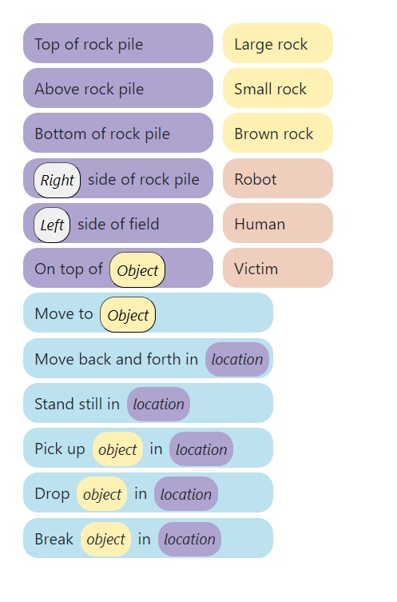
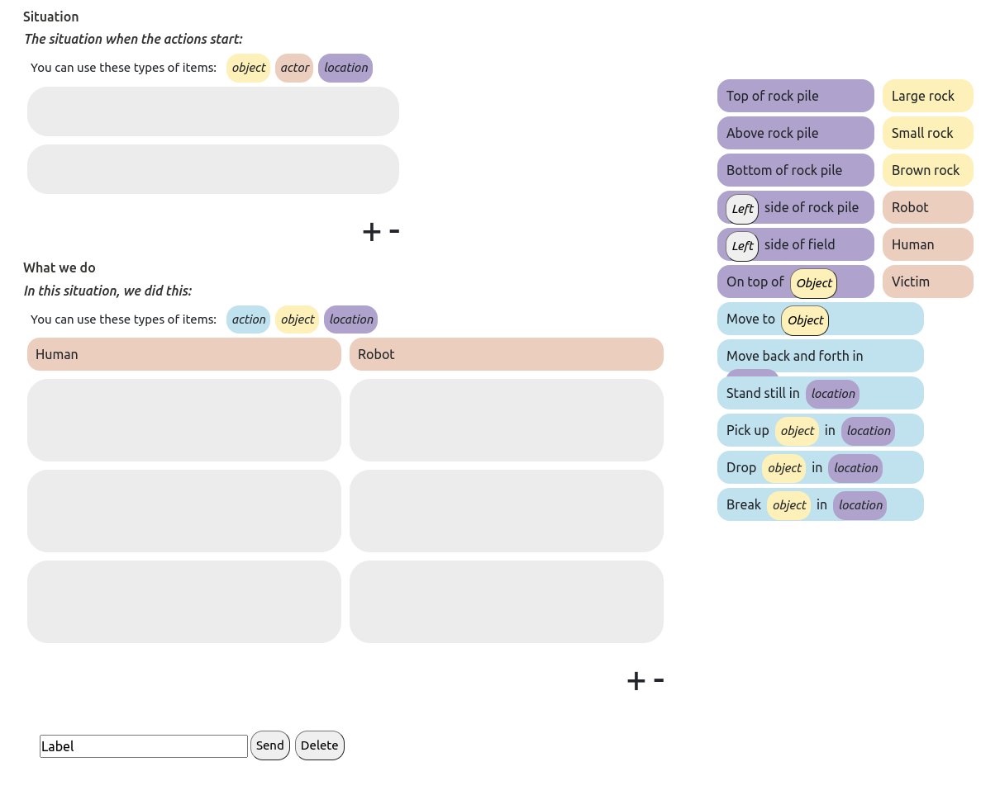

# README for Tae

This is my understanding of what Emma's doing.

## Dependencies

- python3.8
- pip install matrx==2.3.0
- pip install typedb-client
- typedb-server=2.18.0
-

## Agent's decision tree

Collaborations patterns (CPs) are learned by contextual bandits (CBs). Basic behavrior
is learned by by RL (Q-learning).

## State representations

Emma's original state representations were a vector whose length is 18, where every
element was one-hot value. The size of the state space can be then $2^{18}$, which is
too big.

That's why now she has abstract state representations, which is the product of three
sets (progress, contribution, human-standing), whose size are 4, 3, and 2, respectively.
Now the abstract state space size is $4*3*2 = 24$.

- States are represented as a tuple [progress, contribution, human-standing]

  - progress: 1, 2, 3, 4
    - relative progress of the number of rocks being removed
  - contribution: equal, human, robot
  - human-standing: true, false

- basic behavior (full MDP)
  - There are five actions for the agent: (1) move back and forth; (2) stand stil; (3)
    pick up; and (4) break, (5) drop
    - These are "macro" actions.
    - These actions are not always the same. For example, "pick up" will apply
      differently by what objects are present in a given state.
    - They are full MDP, which includes p(s'| s, a) and R(s, a).

From the CB point of view, the state space is still the one whose size is 24, and the
action space is all the possible CPs. One CP is a serious of sub-actions. From the CB of
view, one CP is one action. But there are some rules involved here. For example, at
$S_{1}$ only $SC_{2}$ might hold. In this case, it'll execute $CP_{3}$. Let's say at
$S_{3}$, there were no $SC$s that hold, then it'll resort to the basic behavior (RL),
instead of using CB. As for $S_{4}$, both $SC_{1}$ and $SC_{2}$ hold, so the agent can
take either $CP_{1}$ or $CP_{3}$ as an action. CB is learned using the Upper Confidence
Bound (UCB) algorithm. Therefore it'll both explore and exploit to learn the optimal
action, given a state.

The reward functions for the RL and CB are almost the same, except that idle time is
handeled differently.

RL and CB are learned from scratch for both phase 1 and phase 2, although in phase 2, we
can take advantage of the CPs collected. Emma thinks that there won't be so much
learning happening in CB, since CB is only learned when there is more than one CP
applicable in a given state / starting conditions (It has to decide which actions to
choose). This is not so likely since the users will write fine-grained CPs.

This experiment differs from Emma's first co-learning experiments (Becoming Team
Members: Identifying Interaction Patterns of Mutual Adaptation for Human-Robot
Co-Learning):  

- State / action spaces are different.
  - The first experiment had 4 states (also called phases back then). It also had 3
    "macro" actions, which are series of actions.
  - Now we have 24 states and 5 actions.
- There were also two levels back then. Now Every participant will go through a total of
  8 rounds of playing the task. Every round will have a different scenario, but the
  scenarios are grouped in two types of scenarios; one in which breaking rocks can have
  severe negative effects, and one in which there is a brown rock that cannot be picked
  up. Before starting the experiment, participants will have the opportunity to practice
  the task in a simple scenario without the robot.

## My job

In the phase 2, the agent can take advantage of the CPs that were collected in the phase

1. What CP should the agent take given a state?

### Entities and relations

<!--  -->

This is the only vocabulary used. "Robot", "Human", and "Victim" can only be used to
describe situations where they work as objects (yellow). They can't be used as part of
actions. What's also interesting is to see the funciton `def translate_action`, which
translates user-specified actions to actual agent-executable actions. This was necessary
since the users can give ambiguious actions.

## Questions

- I guess for each particpant, in one scenario (4 rounds), the machine will check the
  applicable CPs, before it executes a CP, right? And as they near the end of 4th round,
  there will be more CPs saved?
  - yes
- Are the CPs directly executable? They can be ambiguous.
  - They are, cuz they are hard-coded. They are run row by row. The machine waits for
    the human to do its action before moving on to the next row.
- How do you map the collected data from GUI to the states and actions for the
  contextual bandit?
  - CB is done when there is more than on applicable CPs execute. I think this means
    that the state space for the CB is not the same as that of RL.
- You mentioned that the participant will get a "prompt" to describe a CP. How many of
  these do they get?
  - Prompts will be sent out by the end of a scenario.
- In Phase 2, what should be the strategy of choosing one out of multiple applicable
  CPs? UCB? memory?

## Ontology

I'm gonna make some adjustments to the existing typedb ontology.

### original

- location

  - top of rock pile
  - above rock pile
  - bottom of rock pile
  - right / left side of rock pile
  - right / left side of field
  - on top of (object)

- object

  - large rock
  - small rock
  - brown rock

- actor

  - robot
  - human
  - victim

- action
  - move to (object)
  - move back and forth in (location)
  - stand still in (location)
  - pick up (object) in (location)
  - drop (object) in (location)
  - break (object) in (location)

### modified

- entities

  - actor
    - robot
    - human
    - victim
  - object
    - large rock
    - small rock
    - brown rock
    - rock pile
    - field
  - actor action
    - move back and forth
    - stand still

- relations
  - subclass of
  - superclass of
  - top of
  - above
  - bottom of
  - right side of
  - left side of
  - on top of
  - move to
  - has state
  - pick up
  - drop
  - break

This modified verion kinda simplifies things a bit, but then some restrictions follow. Let's go through them one by one. Btw, "in" is not used anymore, since it's no longer necessary.

- entities
  - actor: superclass of "robot", "human", and "victim"
  - robot: subclass of "actor".
  - human: subclass of "actor".
  - victim: subclass of "actor".
  - object: superclass of "large rock", "small rock", "brown rock", "rock pile", and "field"
  - large rock: subclass of "object".
  - small rock: subclass of "object".
  - brown rock: subclass of "object".
  - rock pile: subclass of "object". This entity can only be a tail, and the relation that follows this has to be "top of", "above", "bottom of", "left side of", or "right side of".
  - field: subclass of object. This entity can only be a tail, and the relation that follows this has to be "left side of" or "right side of".
  - move back and forth: subclass of "actor action". This entity can only be a tail, and the relation that follows has to be "has state"
  - stand still: subclass of "actor action". Thsi entity can only be a tail, and the relation that follows has to be "has state"
- relations
  - subclass of: This relation describes the relationships between the above mentioned entities
  - superclass of: This relation describes the relationships between the above mentioned entities
  - top of: The tail of this relation has to be "rock pile".
  - above: The tail of this relation has to be "rock pile".
  - bottom of: The tail of this relation has to be "rock pile".
  - right side of: The tail of this relation has to be "rock pile" or "field"
  - left side of: The tail of this relation has to be "rock pile" or "field".
  - on top of: The tail of this relation has to be "large rock", "small rock", or "brown rock".
  - move to: The head of this relation has to be "robot" or "human". The tail of this relation has to be "large rock", "small rock", or "brown rock".
  - has state: The head of this relation has to be "robot" or "human". The tail of has to be "move back and forth" or "stand still".
  - pick up: The head of this relation has to be "robot" or "human". The tail of this relation has to be "large rock", "small rock", or "brown rock".
  - drop: The head of this relation has to be "robot" or "human". The tail of this relation has to be "large rock", "small rock", or "brown rock".
  - break: The head of this relation has to be "robot" or "human". The tail of this relation has to be "large rock", "small rock", or "brown rock".
