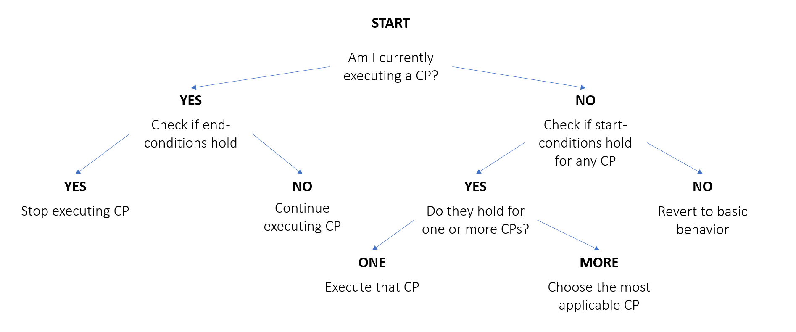
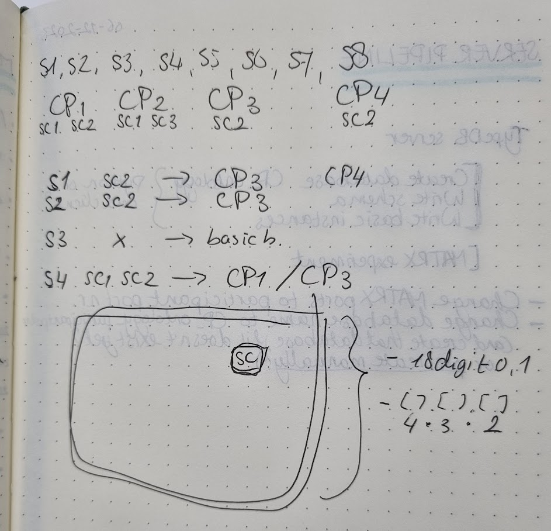
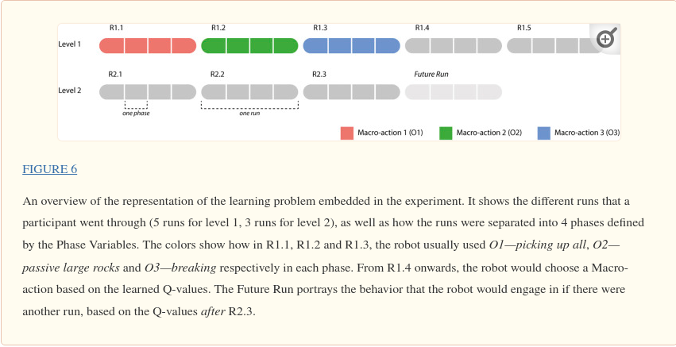
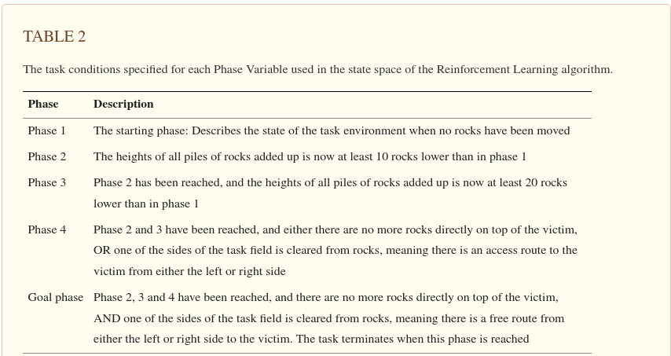

# README for Tae

This is my understanding of what Emma's doing.

## Dependencies

- python3.8
- pip install matrx==2.3.0
- pip install typedb-client
- typedb-server=2.18.0
-

## Agent's decision tree

Collaborations patterns (CPs) are learned by contextual bandits (CBs). Basic behavrior is
learend by by RL (Q-learning).

## State representations

Emma's original state representations were a vector whose length is 18, where every element
was one-hot value. The size of the state space can be then $2^{18}$, which is too big.

That's why now she has abstract state representations, which is the product of three sets
(progress, contribution, human-standing), whose size are 4, 3, and 2, respectively.
Now the abstract state space size is $4*3*2 = 24$.

- States are represented as a tuple [progress, contribution, human-standing]

  - progress: 1, 2, 3, 4
    - relative progress of the number of rocks being removed
  - contribution: equal, human, robot
  - human-standing: true, false

- basic behavior (full MDP)
  - There are five actions for the agent: (1) move back and forth; (2) stand stil;
    (3) pick up; and (4) break, (5) drop
    - These are "macro" actions.
    - These actions are not always the same. For example, "pick up" will apply differently
      by what objects are present in a given state.
    - They are full MDP, which includes p(s'| s, a) and R(s, a).

From the CB point of view, the state space is still the one whose size is 24, and the
action space is all the possible CPs. One CP is a serious of sub-actions. From the CB
of view, one CP is one action. But there are some rules involved here. For example,
at $S_{1}$ only $SC_{2}$ might hold. In this case, it'll execute $CP_{3}$. Let's say at
$S_{3}$, there were no $SC$s that hold, then it'll resort to the basic behavior (RL),
instead of using CB. As for $S_{4}$, both $SC_{1}$ and $SC_{2}$ hold, so the agent can
take either $CP_{1}$ or $CP_{3}$ as an action. CB is learned using the Upper Confidence
Bound (UCB) algorithm. Therefore it'll both explore and exploit to learn the optimal
action, given a state.

The reward functions for the RL and CB are almost the same, except that idle time is
handeled differently.

RL and CB are learned from scratch for both phase 1 and phase 2, although in phase 2,
we can take advantage of the CPs collected. Emam thinks that there won't be so much
learning happening in CB, since CB is only learned when there is more than one CP
applicable in a given state / starting conditions (It has to decide which actions to
choose). This is not so likely since the users will write fine-grained CPs.

This experiment differs from Emma's first co-learning experiments (Becoming Team Members: Identifying Interaction Patterns of Mutual Adaptation for Human-Robot Co-Learning):
 

- State / action spaces are different.
  - The first experiment had 4 states (also called phases back then). It also had 3 "macro" actions, which are series of actions.
  - Now we have 24 states and 5 actions.
- There were also two levels back then. Now Every participant will go through a total of 8 rounds of playing the task. Every round will have a different scenario, but the scenarios are grouped in two types of scenarios; one in which breaking rocks can have severe negative effects, and one in which there is a brown rock that cannot be picked up. Before starting the experiment, participants will have the opportunity to practice the task in a simple scenario without the robot.

## My job

In the phase 2, the agent can take advantage of the CPs that were collected in the phase 1.
What CP should the agent take given a state?
